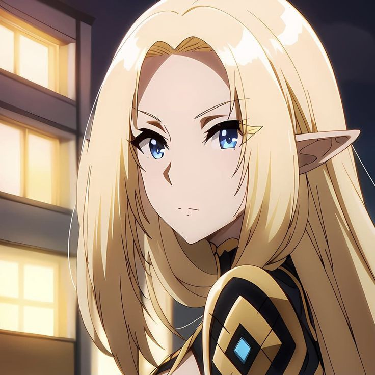
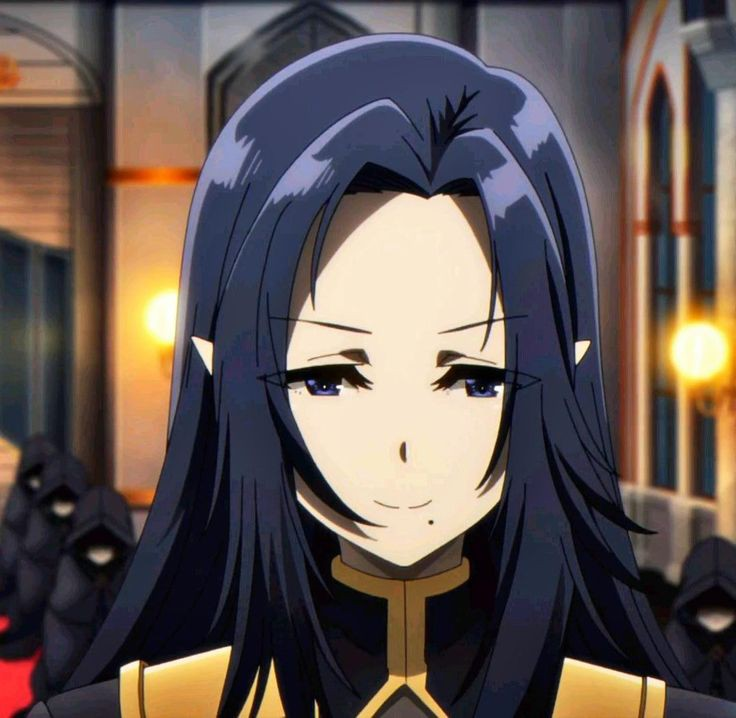
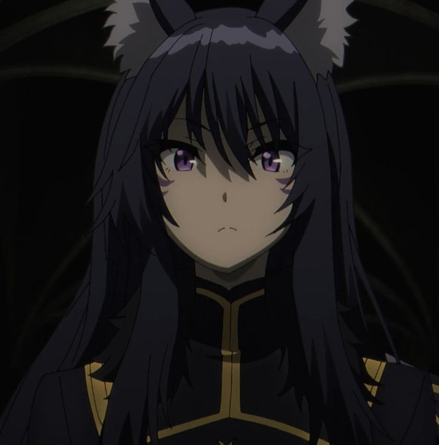
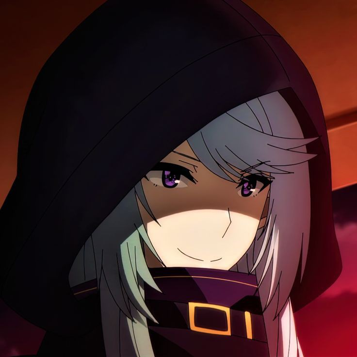
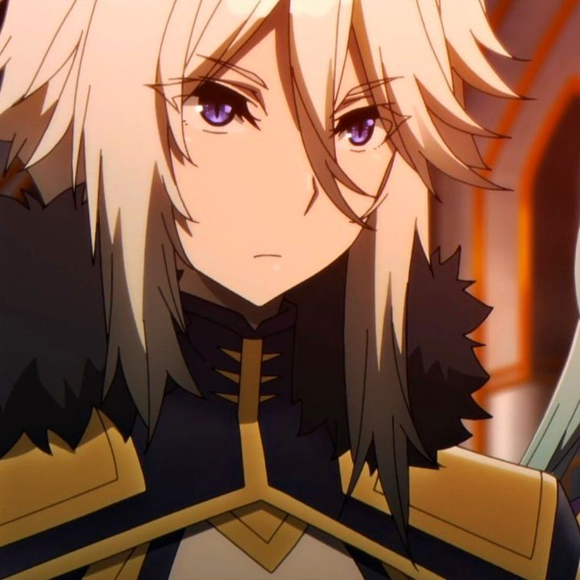
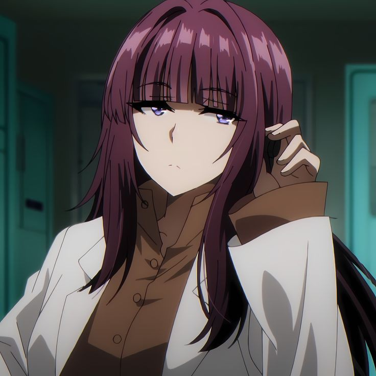

## The Seven Shadows

The Seven Shadows are Cid Kagenou's elite shadow organization.  Each member possesses unique skills and plays a crucial role in Cid's plans.

| Member Name | Image             | Description                                                                        |
|--------------|----------------------|------------------------------------------------------------------------------------|
| Cid Kagenou (King)        |  | [Description - already provided above]                                            |

| Member Name | Image             | Description                                                                        |
|--------------|----------------------|------------------------------------------------------------------------------------|
| Alpha (Leader)       |  | [Alpha is the strongest of the Seven Shadow Garden, a powerful magic swordsman. He's a loyal and determined individual, always putting the well-being of his comrades first. However, his true strength is hidden beneath a seemingly playful and carefree exterior.]                                            |
| Beta         |   | [Beta is the brains of the group, a skilled strategist and an expert in magic. She's known for her calm and collected demeanor, but she can also be incredibly ruthless when necessary.] |
| Gamma        |  | [Gamma is a master of martial arts, wielding her fists with incredible speed and power. She's fiercely independent and often acts as the voice of reason within the Seven Shadow Garden.]|
| Delta        |  | [Delta is a skilled archer and marksman, known for her pinpoint accuracy. She's fiercely loyal to her comrades and will stop at nothing to protect them.]|
| Epsilon      |  | [Epsilon is a master of illusions and deception, capable of manipulating the minds of others. He's a cunning and manipulative individual, but he also has a strong sense of justice.]|
| Zeta         |   | [Zeta is a master of stealth and infiltration, capable of moving through shadows undetected. She's a skilled assassin and a deadly opponent in close combat.] |
| Eta          |    | [Eta is a skilled healer and a master of life magic. She's a kind and compassionate individual, always willing to help those in need.]  |

## License

MIT License

Copyright (c) Date: January 20, 2025 | Name and Organization name Aljur Pogoy/GeoArchonsTeam

Permission is hereby granted, free of charge, to any person obtaining a copy
of this software and associated documentation files (the "Software"), to deal
in the Software without restriction, including without limitation the rights
to use, copy, modify, merge, publish, distribute, sublicense, and/or sell
copies of the Software, and to permit persons to whom the Software is
furnished to do so, subject to the following conditions:

The above copyright notice and this permission notice shall be included in all
copies or substantial portions of the Software.

THE SOFTWARE IS PROVIDED "AS IS", WITHOUT WARRANTY OF ANY KIND, EXPRESS OR
IMPLIED, INCLUDING BUT NOT LIMITED TO THE WARRANTIES OF MERCHANTABILITY,
FITNESS FOR A PARTICULAR PURPOSE AND NONINFRINGEMENT. IN NO EVENT SHALL THE
AUTHORS OR COPYRIGHT HOLDERS BE LIABLE FOR ANY CLAIM, DAMAGES OR OTHER
LIABILITY, WHETHER IN AN ACTION OF CONTRACT, TORT OR OTHERWISE, ARISING FROM,
OUT OF OR IN CONNECTION WITH THE SOFTWARE OR THE USE OR OTHER DEALINGS IN THE
SOFTWARE.

